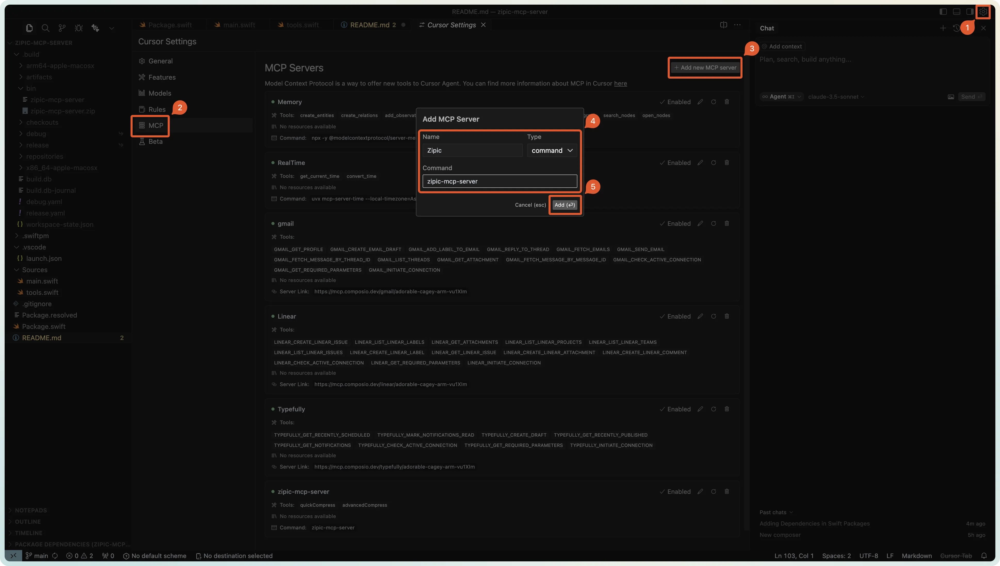

# Zipic MCP Server

A Model Context Protocol server that provides image compression and optimization capabilities through Zipic app. This server enables LLMs to compress and optimize images using Zipic's powerful features.


## Available Tools

* `quickCompress` - Quickly compress images using Zipic's default settings
  * `urls` (array of strings, required): Array of image URLs to compress

* `advancedCompress` - Compress images with advanced options
  * `urls` (array of strings, required): Array of image URLs to compress
  * `format` (string, optional): Output format (e.g., "webp", "jpg", "png")
  * `level` (number, optional): Compression level (1-100)
  * `width` (number, optional): Target width
  * `height` (number, optional): Target height
  * `specified` (boolean, optional): Whether to use Zipic's default output directory
  * `location` (string, optional): Location type when specified is false ("custom")
  * `directory` (string, optional): Custom output directory when location is "custom"
  * `addSubfolder` (boolean, optional): Create subfolder for output
  * `addSuffix` (boolean, optional): Add suffix to output filename
  * `suffix` (string, optional): Custom suffix when addSuffix is true

## Installation

### Option 1: Download Pre-built Binary

1. Download and install [Zipic](https://zipic.app) app
2. Download the latest `zipic-mcp-server` binary from [GitHub Releases](https://github.com/okooo5km/zipic-mcp-server/releases)
3. Make the binary executable:

   ```bash
   chmod +x /path/to/zipic-mcp-server
   ```

4. Move the binary to a directory in your PATH (optional):

   ```bash
   sudo mv /path/to/zipic-mcp-server /usr/local/bin/
   ```

### Option 2: Build from Source

1. Download and install [Zipic](https://zipic.app) app
2. Clone the repository:

   ```bash
   git clone https://github.com/5km/zipic-mcp-server.git
   cd zipic-mcp-server
   ```

3. Choose a build option:

   ```bash
   # Option A: Build for Apple Silicon (arm64)
   swift build -c release --arch arm64 -j $(sysctl -n hw.ncpu)
   
   # Option B: Build for Intel (x86_64)
   swift build -c release --arch x86_64 -j $(sysctl -n hw.ncpu)
   
   # Option C: Build Universal Binary (both arm64 and x86_64)
   mkdir -p .build/bin
   lipo -create \
     -output .build/bin/zipic-mcp-server \
     $(swift build -c release --arch arm64 --show-bin-path)/zipic-mcp-server \
     $(swift build -c release --arch x86_64 --show-bin-path)/zipic-mcp-server
   ```

4. Install the binary (optional):

   ```bash
   # After building, choose ONE of these commands based on your build choice:
   
   # If you built for arm64 (Option A):
   sudo cp .build/apple/Products/Release/zipic-mcp-server /usr/local/bin/
   
   # If you built for x86_64 (Option B):
   sudo cp .build/x86_64-apple-macosx/release/zipic-mcp-server /usr/local/bin/
   
   # If you built universal binary (Option C):
   sudo cp .build/bin/zipic-mcp-server /usr/local/bin/
   ```

## Configuration

### Configure for Claude.app

Add to your Claude settings:

```json
"mcpServers": {
  "zipic": {
    "command": "zipic-mcp-server"
  }
}
```

### Configure for cursor



## Requirements

* Swift 6.0 or later
* macOS 14.0 or later
* Zipic app installed
* [MCP Swift SDK](https://github.com/gsabran/mcp-swift-sdk) 0.2.0 or later

## Version History

See [GitHub Releases](https://github.com/okooo5km/zipic-mcp-server/releases) for version history and changelog.

## License

zipic-mcp-server is licensed under the MIT License. This means you are free to use, modify, and distribute the software, subject to the terms and conditions of the MIT License. For more details, please see the LICENSE file in the project repository.
